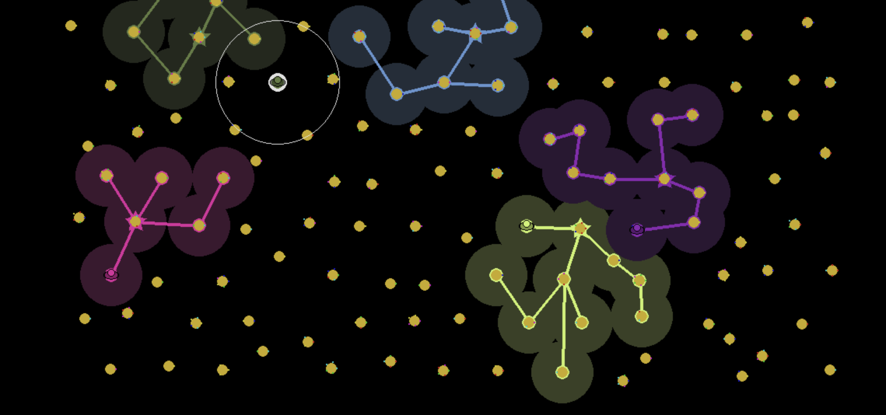

# Grand Space

A grand(-ish) space strategy game inspired by various space opera/sci-fi games programmed with Python and pygame.

## Running the game

The game is programmed using the pygame library for Python, which is available, e.g. through the `pip` package manager for Python. Check out `pygame.org` for more details.

Python version 3 is best, though I think it should be compatible with Python 2. 

Run the command `python display.py`, and all else being well with your Python/pygame installation, it should work. 

## Why Python

I started this project in December 2023, though I had the idea for it further back. I decided to use Python and pygame after the amateur programmer that is me did not want to wrestle with unfamiliar graphics libraries and deal with programming languages I don't fully understand. Doing it in pygame means I can actually make something resembling progress. 

# The Game

### Main Idea

You control a spacefaring empire that has just learned the secrets of interstellar travel. However, you are not the only ones to do so. 

The Galaxy consists of several star systems, each with 1-5 planets. Planets can be colonized and have their minerals harvested and sold to other colonies, allowing for upgrades to your ships, colonies, and more. 

The amount that you can do as a player is limited by how much money you have and how many ships you have. 

### Game Components

The gameplay features are divided into six different categories: 
- Discovery: exploring the galaxy and discovering technologies
- Empire: establishing and developing colonies across the galaxy
- Trade: producing and trading minerals for lots of money
- Ecology: researching diverse lifeforms and making planets more habitable for sentient life
- Diplomacy: interacting with other players, doing favors for them, and receiving favors in exchange
- Warfare: fighting other players, from stealing their minerals to conquering their worlds

## Winning the Game

The game centers around the six game components, each of which have earnable *milestones* from doing activities related to the components.

Each component has 5 milestones to achieve, which each grant a bonus. The player who first achieves the fifth and final milestone in 3 different components wins the game.

## Overview of Game Mechanics

### Colonies

Each player starts with a homeworld colony, which, after centuries of overharvesting and pollution during its primitive phases of technological development, is no longer very productive. The player should instead expand out into the wider galaxy and establish colonies on other planets. 

Placing a colony in a star system claims that star system as your own, and other players cannot place colonies there. 

Colonies have two levels of development: 
- Number of cities: the number of cities determines the maximum development and the maximum storage capacity of minerals
- Development: capped by the number of cities as well as the habitability of the planet (see more later), determines how quickly minerals are produced

Planets have varying levels of habitability, which determines how much the planet can be developed. Habitability is discussed in more depth with Ecology. 

There are two broad strategies in establishing colonies: playing tall, or playing wide. Player tall means developing existing colonies and colonizing planets nearest to one's existing colonies. Playing wide means staking a claim over many different star systems. Playing tall allows for more mineral production sooner and more efficiently, while player wide achieves colonial milestones more quickly and stakes claim over systems that rivals might colonize.

Colonial milestones are earned through colonizing new star systems, colonizing new planets, building cities, and developing existing colonies. Note that more milestone points are earned from playing wide than playing tall.

### Discovery

Discovery refers collectively to exploration of the galaxy and researching new technologies.

Throughout the galaxy are scattered mysterious alien artifacts that contain long-lost secrets and treasures that can be used to kick-start a player's empire. Without these artifacts, investing in colonies will be very difficult. 

Artifacts are located in random places around the galaxy, and ships are needed to go looking for them. Collecting artifacts and returning them to the homeworld gives a sizable amount of money, and some science points.

Science allows for upgrading technology, including ship equipment, colony development, and just about everything. 

Science comes in three flavors:
- Power: combat and war, settlement and expansion
- Harmony: diplomacy and ecology
- Prosperity: trade, mineral production, ships

Technologies have costs in particular flavors (i.e., power technologies, harmony technologies, prosperity technologies). Science can be converted to different flavors at a cost. 

Science is earned in three ways:
- Milestones: there are six milestone categories, and when certain objectives are achieved, a boost to science is provided, with some flavored and some wild
- Research Missions: ships can "trade" for science, granting a small amount of wild science and some money
- Consumption: each flavor of science can be produced additionally through certain costs

The milestone categories are:
- Exploration: gained through exploring new stars and collecting artifacts; grants prosperity science
- Wealth: gained through earning and having money; grants prosperity science
- Military: gained through combat, conquest, and defense; grants power science
- Empire: gained through expansion, settlement, and development; grants power science
- Ecology: gained through collecting biomass and terraforming; grants harmony science
- Diplomacy: gained through making allies and doing diplomatic actions; grants harmony science

Consumption sources are:
- Paying money to gain prosperity science
- Consuming biomass to gain harmony science
- Participating in battles to gain power science, especially as the defender

Discovery milestones are earned by collecting artifacts and researching technologies.

### Trade

Colonies, once sufficiently developed, produce minerals, which other colonies will buy. The amount each colony will pay for the mineral varies sporadically, so trading partners should change occasionally for the best value. Ships need to carry the minerals between planets, which takes time. 

Colonies have a number, based on the number of cities, of minerals currently demanded. Of these, they have a demand which can be between 1 and 5, and determines the price they will pay for the mineral. The demand for the mineral will eventually fade away and a new mineral will be demanded. Minerals that are not demanded can still be sold, but at a very low price.

Ships can have a variety of trade methods, and more unlocked with propserity technology. Having a low supply of minerals will mean that the best method is to search and wait for the best possible price. Having a high supply of minerals means the ship is rather time-limited than mineral-limited, and so will settle for lower prices. 

Trade milestones are earned by selling minerals, and by making money by all means, except gifts.

### Diplomacy

Players can interact with each other by doing favors for each other and earning leverage points. Doing a favor for another player grants leverage points over that player. One player sufficient leverage on another player means that they can ask for certain favors, including money, military support, allowing access to their systems.

Players can also refuse favors or restrict access to their systems, which may drop their leverage into negative values. At this point, under the logic of "they started it", the opposing player may start to carry out warfare against them.

Diplomacy milestones are dynamic, and earned by having a large total amount of leverage.

### Warfare

Players' ships may likely end up in conflict, which always starts with more benign diplomatic incidents. War can be carried out to harass opponents, take their minerals, or conquer and plunder their colonies.

Players end up in conflict if they carry out hostile actions against one another, including by restricting access to systems, refusing leverage-based favors, or raiding or attacking systems, if there is already conflict. 

A player can only engage in open conflict against another player if that other player has negative leverage over the player; in other words, if the other player did something to annoy them.

Ships can raid systems, meaning stealing minerals or biomass from rival planets, attack enemy ships, whether to harass or prevent passage through one's territory, or besiege colonies, damaging them with the end goal of plundering them for money or taking them over. 

Players who are losing in war suffer from losing ships, minerals, and sometimes also colonies. Such players also benefit from the war by gaining significant amounts of Power science and Warfare milestone points - about twice as much as the winning player gets. This allows players who would be significantly set back from warfare to have an easier chance of winning the game, or accelerating expansion or revenge through Power technologies. 

Warfare milestones are earned by raiding planets, damaging ships, conquering cities. A large number milestone points are also earned from ships being destroyed and losing cities to rivals.  

### Ecology

A final, wildcard aspect of the game is ecology, which can vastly improve colonies by increasing their planets' habitability, called terraforming. Terraforming requires biomass as a base component, which then, at the cost of a lot of money and ship time, can be used to boost the ecosystem of a planet. 

Biomass can be collected from planets with habitability. Players' homeworlds start with habitability, but there are also weakly habitable planets randomly scattered throughout the galaxy. Each habitable planet has a number of species present, which are collected as samples when biomass is collected from the planet.

The total biomass value of a set of samples determines how useful the samples of biomass are. Total biomass value increases with the number of samples, but increases greatly with the diversity of species among the samples:
- Each group of 2 samples of different species has a value of 3 biomass
- Each group of 3 different samples has a value of 6 biomass
- And so on, where each group of `X` samples is worth `X` more than a group of `X-1` samples. See also the sequence of "triangle numbers". 

In addition to use in terraforming planets to increase their habitability, biomass can be consumed and converted into Harmony science. 

Ecology milestones are earned by collecting biomass samples, terraforming, and total biomass value spent.
